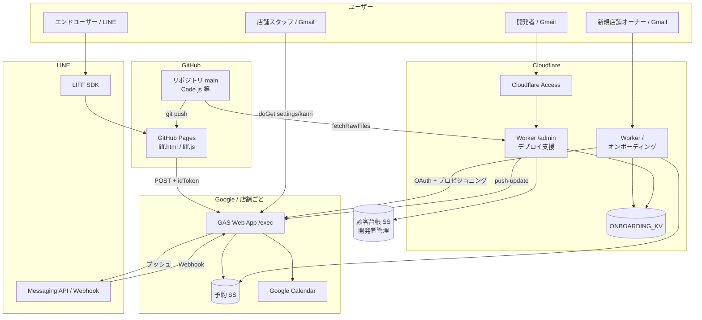
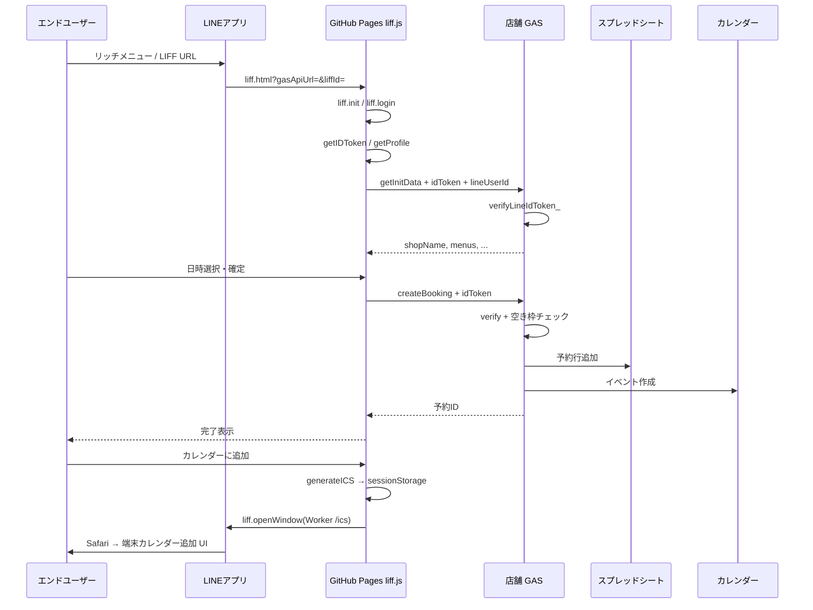
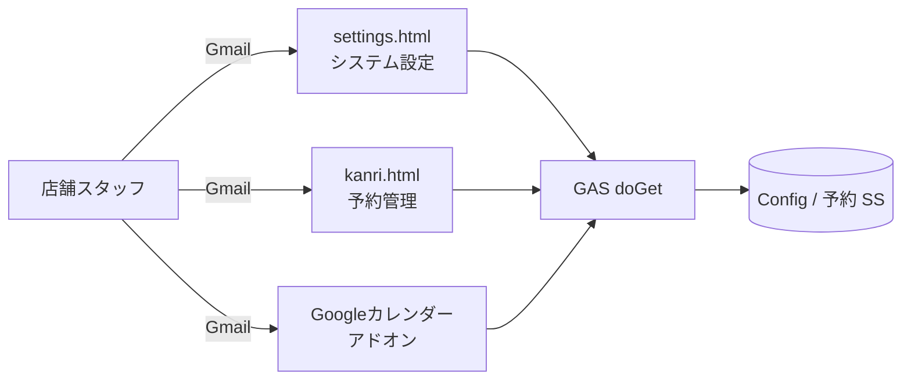
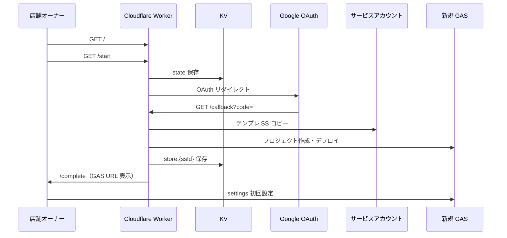
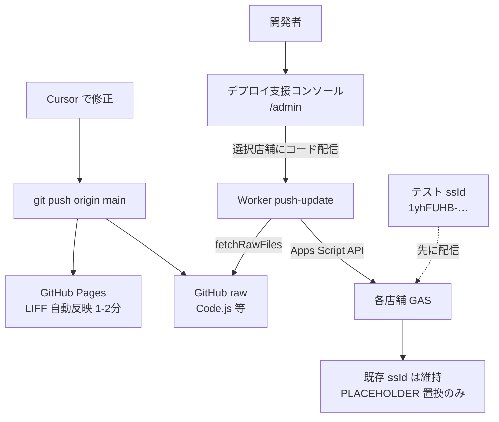
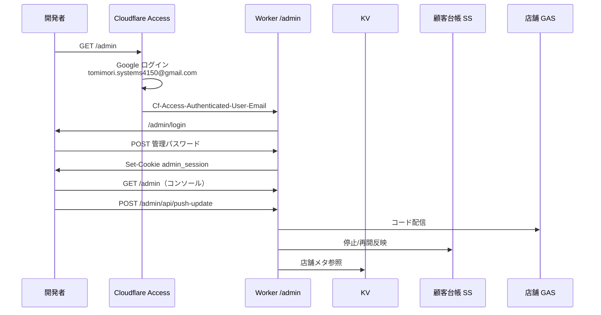
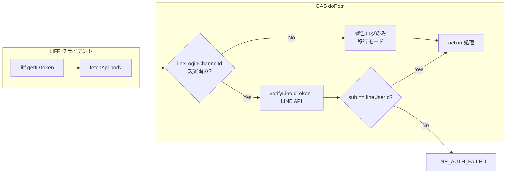

# LINE連動型予約システム アーキテクチャ・データフロー図

**作成日**: 2026-06-18  
**目的**: GitHub Pages / GAS / Cloudflare Worker / LINE / Google など複数環境を横断して把握するための図集  
**関連**: [システム設計書_v2.md](./システム設計書_v2.md) / [セキュリティ設計書.md](./セキュリティ設計書.md)

---

## 1. 環境一覧（何がどこにあるか）

| # | 環境 | ホスティング | URL 例 | データ |
|---|------|--------------|--------|--------|
| A | LIFF 予約 UI | GitHub Pages | `https://tomimorisystems4150-ai.github.io/reservation-liff-app/liff.html` | なし（静的） |
| B | GAS バックエンド | Google Apps Script | `https://script.google.com/macros/s/{deploymentId}/exec` | SS / Calendar |
| C | オンボーディング | Cloudflare Workers | `https://reservation-onboarding.reservation-onboarding.workers.dev/` | KV |
| D | デプロイ支援コンソール | Cloudflare Workers | `.../admin` | KV + 顧客台帳 SS |
| E | LINE Platform | LINE | LIFF / Messaging API | — |
| F | 開発者顧客台帳 | Google Sheets | `CUSTOMER_REGISTRY_SS_ID` | SaaS 契約情報 |
| G | テスト店舗 | GAS + SS | ssId: `1yhFUHB-…` | テストデータ |

**正本（ソースコード）**: GitHub リポジトリ `tomimorisystems4150-ai/reservation-liff-app`（branch: `main`）

---

## 2. 全体コンポーネント図

---

## 3. エンドユーザー予約フロー（LIFF）

**カレンダー追加**: LIFF 本番は Cloudflare Worker `GET /ics?d=` 経由（Google アカウント非依存）。GAS `downloadICS` は LIFF からは使わない。

**認証**: LINE ログイン + GAS で ID Token 検証（`lineLoginChannelId` 設定時）

---

## 4. 店舗スタッフフロー

**認証**: Google アカウントが Config の adminEmail / staffs に含まれること

---

## 5. 新規店舗オンボーディング

**公開**: `/` と `/start` は意図的に公開（新規導入のため）

---

## 6. コード配信フロー（開発者 → 店舗 GAS）

| 経路 | 更新対象 |
|------|----------|
| git push のみ | LIFF（GitHub Pages） |
| コンソール配信 | GAS（Code.js, settings.html, kanri.html 等） |

---

## 7. 管理・セキュリティフロー（デプロイ支援コンソール）

詳細: [docs/Cloudflare_Access_設定手順.txt](./docs/Cloudflare_Access_設定手順.txt)

---

## 8. LIFF 認証改修後のデータフロー

---

## 9. テスト環境の位置づけ

| 項目 | 値 |
|------|-----|
| ssId | `1yhFUHB-krCKEovh8MbxQeKx_Vo7s1QUCaMeeBlAaj1w` |
| コンソール表示 | `TEST` バッジ・オレンジ枠パネル |
| 用途 | コード配信検証・LIFF 手動テスト・GAS runTests |
| 本番との関係 | 同一 GitHub main から配信。データは独立 SS |

---

## 10. 変更履歴

| 版 | 日付 | 内容 |
|----|------|------|
| 1.0 | 2026-06-18 | 初版 |
